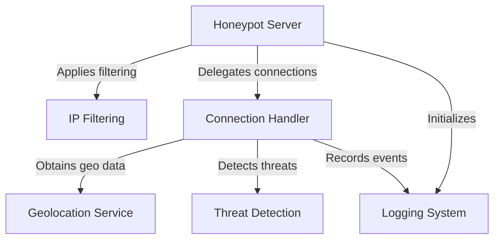
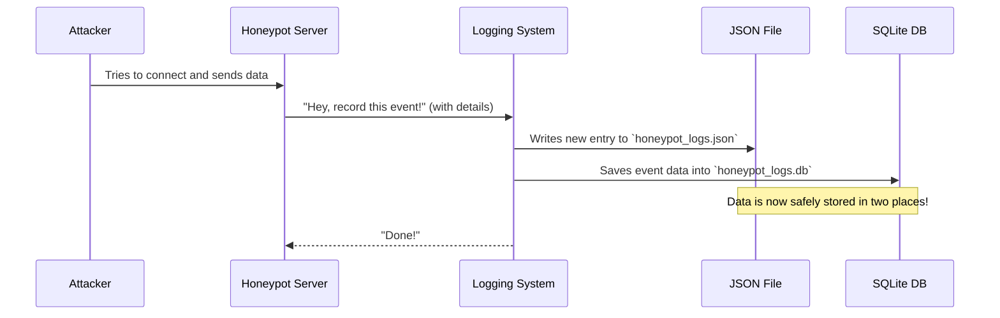
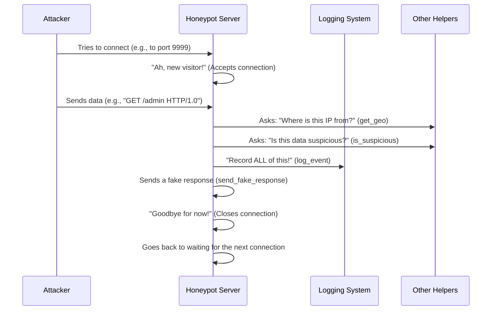
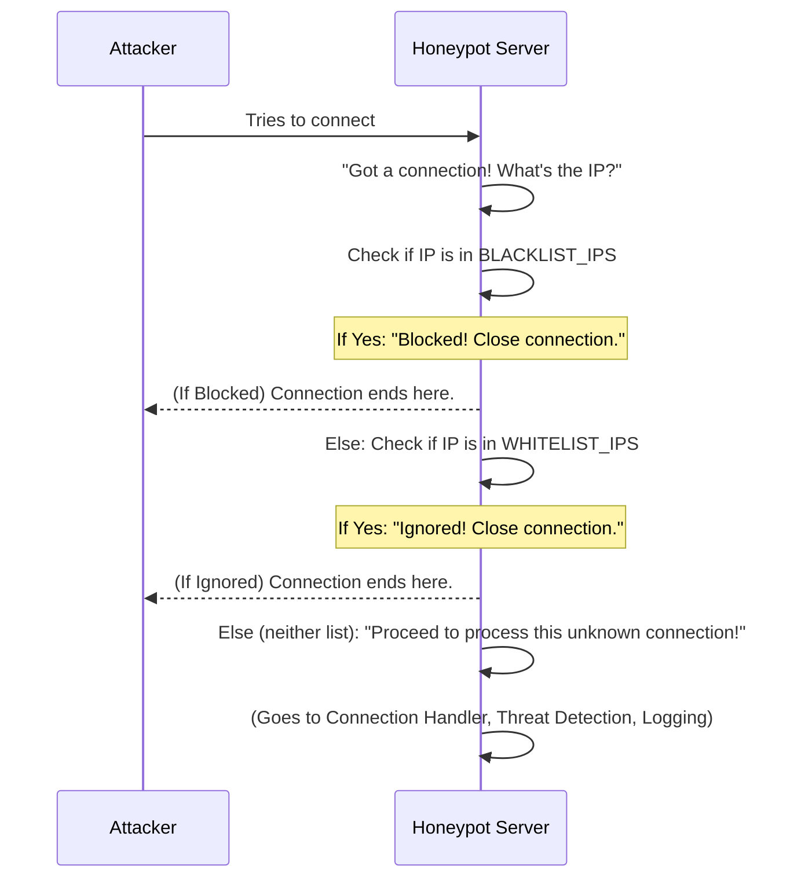
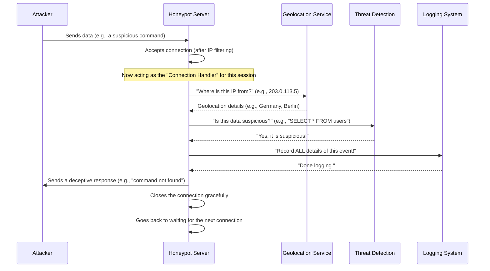
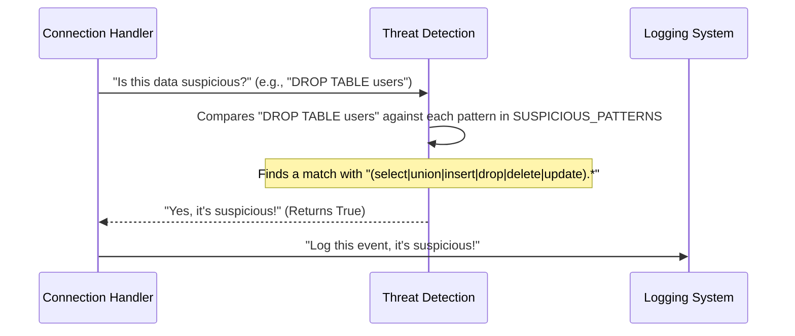
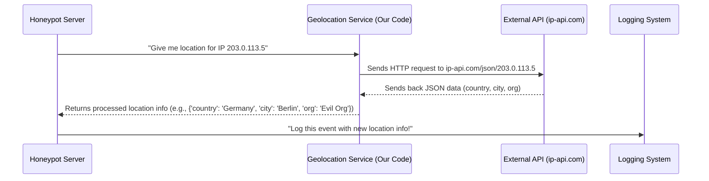

# Tutorial: Honeypot

The `Honeypot` project creates a *deceptive server* designed to **attract and monitor** malicious online activity. It pretends to offer a vulnerable service, but instead of providing real functionality, it silently captures all interactions from potential attackers. This includes logging details like their IP address, location, and the commands they attempt to run, helping in understanding and defending against cyber threats.


## Visual Overview



## Chapters

1. Logging System

2. Honeypot Server

3. IP Filtering

4. Connection Handler

5. Threat Detection

6. Geolocation Service


---
# Chapter 1: Logging System

Welcome to the exciting world of Honeypots! In this first chapter, we'll dive into the very core of our `Honeypot` project: how it remembers everything that happens. Think of it like the honeypot's very own diary or a super-efficient note-taker.

### Why Do We Need a Logging System?

Imagine you set up a trap (our honeypot) to catch digital intruders. If someone falls into your trap, wouldn't you want to know *everything* about them? Like:
*   When did they visit?
*   Where did they come from (their IP address and location)?
*   What did they try to do or send?
*   Was their action suspicious?

Without a way to record this information, our honeypot would be like a security guard with memory loss – it would see intruders but immediately forget them! The "Logging System" is designed to solve this problem. It's the honeypot's brain for storing all this critical information.

**Our main goal in this chapter is to understand how the honeypot captures and saves every detail of an interaction, turning raw events into valuable intelligence.**

### How Does it Work? Two Ways to Remember!

Our Logging System doesn't just store information; it stores it in two smart ways, like keeping a personal diary *and* an organized library catalog.

1.  **The Chronological Diary (JSON File)**: This is a simple text file (`honeypot_logs.json`) where each new event is added to the end, just like writing new entries in a diary. It's easy for humans to read and quickly see the latest events.

    ```json
    {"timestamp": "2023-10-27T10:30:00.123456", "ip": "192.168.1.100", "port": 12345, "data": "Hello World", "geo": {"country": "USA", "city": "New York", "org": "ISP Corp"}, "suspicious": false}
    {"timestamp": "2023-10-27T10:31:15.789012", "ip": "203.0.113.5", "port": 54321, "data": "SELECT * FROM users", "geo": {"country": "Germany", "city": "Berlin", "org": "Evil Org"}, "suspicious": true}
    ```
    Each line here is a complete record of one interaction. You can see the time, IP address, what data was sent, where they are from, and if it was suspicious.

2.  **The Organized Library Catalog (SQLite Database)**: This is a more structured way to store data. Think of it like a spreadsheet or a collection of index cards, where each piece of information (timestamp, IP, data) has its own dedicated slot. This makes it super easy to search, sort, and analyze the data later. For example, you could quickly find all attacks from "Germany" or all "suspicious" activities.

    ```
    | id | timestamp                 | ip            | port  | data                | country | city   | org       | suspicious |
    |----|---------------------------|---------------|-------|---------------------|---------|--------|-----------|------------|
    | 1  | 2023-10-27T10:30:00.123456| 192.168.1.100 | 12345 | Hello World         | USA     | New York | ISP Corp  | 0          |
    | 2  | 2023-10-27T10:31:15.789012| 203.0.113.5   | 54321 | SELECT * FROM users | Germany | Berlin | Evil Org  | 1          |
    ```
    This table structure makes it powerful for asking questions like "Show me all entries where 'suspicious' is true."

### Why Both?

Having both formats gives us the best of both worlds:

| Feature          | JSON File (Diary)                         | SQLite Database (Library Catalog)        |
| :--------------- | :---------------------------------------- | :--------------------------------------- |
| **Purpose**      | Quick, human-readable chronological log | Structured, searchable, and analyzable |
| **Ease of Use**  | Simple to read recent entries           | Great for complex queries and reporting  |
| **File Type**    | `honeypot_logs.json` (text file)          | `honeypot_logs.db` (single database file)|

### Under the Hood: How the Logging System Works

Let's peek behind the curtain to see how our honeypot uses this logging system.

#### The Process Step-by-Step

Imagine an "attacker" tries to connect to our honeypot. Here's what happens:



In simple terms: when our [Honeypot Server](02_honeypot_server_.md) receives data from an attacker, it tells the Logging System to save all the details. The Logging System then makes sure this information is stored in both our JSON "diary" and our SQLite "library."

#### The Code Behind the Logs

Let's look at the key parts of the `Honeypot.py` file that make this happen.

First, we need to make sure our SQLite database is ready. If the database file doesn't exist, we create it and set up the table structure (our "library catalog").

```python
# Honeypot.py

import sqlite3
import os # Used to check if file exists

# Name of our database file
DB_FILE = 'honeypot_logs.db'

# This function sets up our database if it's new
def setup_db():
    # Check if the database file doesn't exist yet
    if not os.path.exists(DB_FILE):
        # Connect to the database (creates it if it doesn't exist)
        conn = sqlite3.connect(DB_FILE)
        c = conn.cursor() # A cursor helps us run commands
        # Create a table named 'logs' with specific columns
        c.execute('''CREATE TABLE logs (
            id INTEGER PRIMARY KEY AUTOINCREMENT,
            timestamp TEXT,
            ip TEXT,
            port INTEGER,
            data TEXT,
            country TEXT,
            city TEXT,
            org TEXT,
            suspicious INTEGER
        )''')
        conn.commit() # Save the changes
        conn.close() # Close the connection
```
This `setup_db()` function is called when the honeypot first starts. It's like preparing an empty notebook and drawing lines and column headers if you don't have one already. Each column (like `ip`, `data`, `country`) is where a specific piece of information will be stored.

Next, the most important part: the `log_event` function. This is the heart of our Logging System!

```python
# Honeypot.py

import datetime # To get the current time
import json     # To work with JSON format
# ... (other imports) ...

# Name of our JSON log file
JSON_LOG_FILE = 'honeypot_logs.json'
# ... (DB_FILE definition from above) ...

# This function records all the details of an event
def log_event(addr, data, geo, suspicious):
    # 1. Prepare the log entry as a dictionary (like a temporary note)
    log_entry = {
        "timestamp": datetime.datetime.now().isoformat(), # Current time
        "ip": addr[0],     # Attacker's IP address
        "port": addr[1],   # Attacker's port
        "data": data,      # What the attacker sent
        "geo": geo,        # Geolocation details (country, city, etc.)
        "suspicious": suspicious # Was it suspicious? (True/False)
    }

    # 2. Write to the JSON file (the diary)
    with open(JSON_LOG_FILE, 'a') as f: # 'a' means append (add to end)
        f.write(json.dumps(log_entry) + '\n') # Convert to JSON text and add to file

    # 3. Write to the SQLite database (the library catalog)
    conn = sqlite3.connect(DB_FILE) # Connect to the database
    c = conn.cursor()
    # Insert the data into our 'logs' table
    c.execute("INSERT INTO logs (timestamp, ip, port, data, country, city, org, suspicious) VALUES (?, ?, ?, ?, ?, ?, ?, ?)",
              (log_entry["timestamp"], log_entry["ip"], log_entry["port"], log_entry["data"],
               geo["country"], geo["city"], geo["org"], int(suspicious))) # Use int(suspicious) for 0/1
    conn.commit() # Save the changes to the database
    conn.close()  # Close the database connection
```
The `log_event` function is called every time a connection is handled by the honeypot. It gathers all the pieces of information (`addr`, `data`, `geo`, `suspicious`) and then diligently writes them down in both the JSON file and the SQLite database. This ensures that no interaction goes unrecorded!

### Conclusion

You've just learned about the "Logging System," the crucial "memory" of our `Honeypot` project. It's responsible for turning fleeting network interactions into persistent, valuable intelligence by storing every detail in both easy-to-read JSON files and powerful, searchable SQLite databases. This dual storage method ensures we have a complete audit trail for analysis and reporting.

In the next chapter, we'll explore the central component that listens for incoming connections and uses this Logging System: the [Honeypot Server](02_honeypot_server_.md).

---

</sup></sub> <sub><sup>**References**: [[1]](https://github.com/Hack-Stone/Honeypot/blob/d032b2cc371c7bb869aa27ecac033b225bab6f7b/Honeypot.py)</sup></sub>
# Chapter 2: Honeypot Server

Welcome back to the `Honeypot` project! In [Chapter 1: Logging System](01_logging_system_.md), we learned how our honeypot remembers every detail of an interaction, like keeping a super-detailed diary and an organized library. But how does the honeypot *get* these interactions in the first place? How does it actually *attract* and *listen* for digital intruders?

This is where the **Honeypot Server** comes in.

### What is a Honeypot Server?

Imagine you want to catch fish. You don't just stand by the water's edge hoping fish jump out. You set up a fishing rod with bait, or a net, and then you wait patiently.

The Honeypot Server is exactly like that fishing net or a "fake treasure chest" deliberately left out in the open. It's the core part of our honeypot that patiently waits, listens, and interacts with anything that connects to it. It *pretends* to be a real, interesting service (like a web server or a login portal), but its true purpose is to observe and gather information about anyone who tries to interact with it.

**The main problem the Honeypot Server solves is enabling our computer to actively listen for, accept, and handle incoming connections from potentially malicious entities, without providing any real services.** It's the digital bait that attackers will try to bite!

### How Does the Honeypot Server Work?

At its heart, a server is just a program that listens for network connections. Think of it like a shop owner who opens their doors and waits for customers. Our Honeypot Server does these key things:

1.  **Sets up a Listening Post:** It chooses a specific "address" on your computer (an IP address and a port number, like `0.0.0.0:9999`) and "opens its ears" to listen for incoming connection requests.
2.  **Greets New Visitors:** When someone tries to connect, it "shakes hands" (accepts the connection) and establishes a direct line of communication.
3.  **Observes and Records:** Instead of actually serving them, it silently watches what they send, captures their messages, and then uses our [Logging System](01_logging_system_.md) to record everything.
4.  **Says Goodbye:** After observing, it closes the connection.
5.  **Stays Open for Business:** It then goes back to step 1, waiting for the *next* visitor.

### Using the Honeypot Server: `start_honeypot()`

All the magic of our Honeypot Server is wrapped up in one central function: `start_honeypot()`. When you run our `Honeypot.py` program, this function is called to bring our honeypot to life.

You don't need to give it any special inputs. Just run the script, and it will start listening.

```python
# Honeypot.py

# ... (other functions like setup_db, get_geo, is_suspicious, log_event, send_fake_response) ...

def start_honeypot():
    # 1. Prepare our database for logging
    setup_db()
    # 2. Print a nice message to show it's running
    print(colored(f"\n[STARTED] Honeypot listening on {HOST}:{PORT}", "green"))

    # ... (rest of the server code) ...

# This makes sure start_honeypot() runs when the script is executed
if __name__ == "__main__":
    start_honeypot()
```
When you run the `Honeypot.py` file, the `if __name__ == "__main__":` line ensures that the `start_honeypot()` function is called. This function first makes sure our logging database is ready, then prints a message so you know it's working.

### Inside the Honeypot Server: How it Works

Let's trace what happens when an attacker connects to our Honeypot Server.


As you can see, the Honeypot Server is the central conductor, directing traffic and coordinating with other parts of our system like the [Logging System](01_logging_system_.md), [Geolocation Service](06_geolocation_service_.md), and [Threat Detection](05_threat_detection_.md).

### The Code Behind the Server

Let's break down the `start_honeypot()` function piece by piece to understand its core mechanics.

#### 1. Creating the Socket

The very first step for any server is to create a "socket." Think of a socket as the telephone for your computer. It's the tool that allows programs to send and receive data over a network.

```python
# Honeypot.py

import socket # Needed for network communication

# ... (other code) ...

def start_honeypot():
    setup_db()
    print(colored(f"\n[STARTED] Honeypot listening on {HOST}:{PORT}", "green"))

    # Create a new socket.
    # AF_INET means we're using standard internet addresses (IPv4).
    # SOCK_STREAM means we're using TCP, which is like a reliable phone call.
    with socket.socket(socket.AF_INET, socket.SOCK_STREAM) as server:
        # ... (rest of the server code) ...
```
Here, `socket.socket(socket.AF_INET, socket.SOCK_STREAM)` creates our main "listening" socket. We use `with ... as server:` so Python automatically handles closing the socket properly, even if errors occur.

#### 2. Binding and Listening

Next, we need to "bind" our socket to a specific address and "listen" for connections. Binding is like telling the post office where your house is (your IP address and port number). Listening is like putting out a "Now Open" sign.

```python
# Honeypot.py

# ... (imports and config) ...

# HOST = '0.0.0.0' means listen on all available network interfaces
# PORT = 9999 is the specific port number we'll listen on

def start_honeypot():
    # ... (socket creation) ...
    with socket.socket(socket.AF_INET, socket.SOCK_STREAM) as server:
        server.bind((HOST, PORT)) # Assigns our server to the IP and Port
        server.listen(10)        # Starts listening for incoming connections
                                 # 10 is the max number of waiting connections
        # ... (rest of the server code) ...
```
`server.bind((HOST, PORT))` tells our server to listen on `0.0.0.0` (which means it will accept connections on any network interface of your computer) and specifically on port `9999`. `server.listen(10)` then activates the listening. The `10` means it can queue up to 10 incoming connections if they arrive at the same time, before it starts rejecting new ones.

#### 3. Accepting Connections and Handling Data

This is the continuous loop where the server does its job. It constantly waits for new connections, accepts them, reads data, logs it, and then closes the connection.

```python
# Honeypot.py

# ... (imports and config) ...

def start_honeypot():
    # ... (setup and bind/listen) ...
    with socket.socket(socket.AF_INET, socket.SOCK_STREAM) as server:
        server.bind((HOST, PORT))
        server.listen(10)

        while True: # Keep running forever!
            client, addr = server.accept() # Wait for a connection, then accept it
                                          # 'client' is the new connection's socket
                                          # 'addr' is the attacker's (IP, Port)

            # --- Important Note: IP Filtering happens here ---
            # Our server first checks if the IP is blacklisted or whitelisted
            # This is covered in detail in Chapter 3: IP Filtering
            # For simplicity, we skip the code here.

            try:
                # Receive up to 2048 bytes of data from the attacker
                data = client.recv(2048).decode(errors='ignore').strip()

                # Get geolocation details for the attacker's IP
                geo = get_geo(addr[0]) # Covered in Chapter 6: Geolocation Service

                # Check if the data sent by the attacker is suspicious
                suspicious = is_suspicious(data) # Covered in Chapter 5: Threat Detection

                # Log all the gathered information!
                log_event(addr, data, geo, suspicious) # Covered in Chapter 1: Logging System

                # Print details to our console
                print(colored(f"\n[NEW] {addr[0]}:{addr[1]}", "blue"))
                print(colored(f" ↳ Location: {geo['city']}, {geo['country']} | Org: {geo['org']}", "yellow"))
                print(colored(f" ↳ Data: {data}", "green"))
                if suspicious:
                    print(colored(" ⚠ Suspicious activity detected!", "red", attrs=["bold"]))
                    send_fake_response(client) # Send a fake response back

            except Exception as e:
                print(colored(f"[ERROR] {e}", "red"))

            finally:
                client.close() # Always close the connection
```
The `while True:` loop is crucial; it means the server will continuously accept new connections, one after another, as long as the program is running.
*   `server.accept()` is where the server pauses and waits. When a connection comes in, it "accepts" it, and we get two things back: `client` (a new socket to talk *to that specific attacker*) and `addr` (the attacker's IP address and port).
*   `client.recv(2048)` attempts to read up to 2048 bytes of data that the attacker sends. We `decode()` it to make it readable text.
*   The `get_geo`, `is_suspicious`, and `log_event` functions (which we discussed in [Chapter 1: Logging System](01_logging_system_.md) and will cover further in [Chapter 5: Threat Detection](05_threat_detection_.md) and [Chapter 6: Geolocation Service](06_geolocation_service_.md)) are then called to process and record the information.
*   Finally, `client.close()` is called in the `finally` block to ensure that the connection is always properly closed, even if something goes wrong. This frees up resources and prepares the server for the next connection.

### Conclusion

You've now learned about the **Honeypot Server**, the active component of our `Honeypot` project that listens for, accepts, and processes incoming network connections. It acts as a deceptive lure, drawing in potential threats and meticulously recording their interactions with the help of our [Logging System](01_logging_system_.md).

In the next chapter, we'll dive into [IP Filtering](03_ip_filtering_.md), a critical feature that allows our Honeypot Server to decide who it interacts with and who it should ignore or block entirely.

---

</sup></sub> <sub><sup>**References**: [[1]](https://github.com/Hack-Stone/Honeypot/blob/d032b2cc371c7bb869aa27ecac033b225bab6f7b/Honeypot.py)</sup></sub>
# Chapter 3: IP Filtering

Welcome back! In [Chapter 1: Logging System](01_logging_system_.md), we learned how our honeypot meticulously records every interaction, building a detailed diary of digital activity. Then, in [Chapter 2: Honeypot Server](02_honeypot_server_.md), we saw how our honeypot actively listens for and accepts incoming connections, acting as the digital "bait."

But what if you don't want your honeypot to interact with *everyone*? What if you know certain IPs are harmless (like your own computer) or definitely malicious, and you want to handle them differently? This is where **IP Filtering** comes in.

### What is IP Filtering?

Imagine our honeypot as a fancy club with a very specific purpose: to learn about *unknown* and potentially *unwanted* guests. You don't want your best friends accidentally triggering the alarm, nor do you want known troublemakers wasting your bouncer's time.

**IP Filtering** is like the honeypot's very own "bouncer" or "guest list manager." Before anyone even gets to send data or be fully processed by the honeypot, this bouncer checks their IP address against two special lists:

1.  **The "Whitelist" (Friends List):** This list contains IP addresses of people or devices you *know* are safe and friendly. These could be your own computers, security scanners you run, or trusted partners.
2.  **The "Blacklist" (Troublemaker List):** This list contains IP addresses of known malicious attackers, scanners, or other entities you absolutely *do not* want your honeypot to waste time on.

**The main problem IP Filtering solves is reducing noise in your logs and focusing the honeypot's resources on genuinely interesting or unknown threats.** It helps your honeypot be more efficient and provide clearer insights.

### How Does IP Filtering Work?

When a connection tries to reach your honeypot, here's what happens:

*   **Check the Blacklist First:** Is this IP address on the list of known troublemakers?
    *   **YES:** Immediately block the connection. Don't even let them in the door. No log entry is needed beyond a simple "blocked" message, as we already know they're bad.
    *   **NO:** Proceed to the next check.
*   **Check the Whitelist Next:** Is this IP address on your list of known friends?
    *   **YES:** Silently ignore the connection. Let them pass by without interacting or logging their activity. This prevents your own safe activities from cluttering your honeypot logs.
    *   **NO:** This IP is unknown and not explicitly trusted or blocked. Let them in and process their connection as usual, logging everything. This is where the real "honeypot magic" happens for new threats.

This filtering happens *before* the honeypot even begins to receive data or call the [Logging System](01_logging_system_.md).

### Comparing Whitelist vs. Blacklist

These two lists have different but equally important roles:

| Feature      | Whitelist (Friends List)                                   | Blacklist (Troublemaker List)                               |
| :----------- | :--------------------------------------------------------- | :---------------------------------------------------------- |
| **Purpose**  | To ignore known *safe* IPs, reducing log noise.            | To immediately block known *malicious* IPs, saving resources.|
| **Action**   | Connections are silently ignored and not logged.           | Connections are immediately blocked, often with a simple log. |
| **Use Case** | Your own testing, friendly security scans, trusted networks. | IPs from known attack campaigns, persistent annoyances.     |

### Using IP Filtering in Our Honeypot

Our `Honeypot.py` project uses two Python lists, `WHITELIST_IPS` and `BLACKLIST_IPS`, at the very top of the file. You can simply add IP addresses to these lists.

Let's see where these lists are defined:

```python
# Honeypot.py

# ... (other imports) ...

# Config
HOST = '0.0.0.0'
PORT = 9999
JSON_LOG_FILE = 'honeypot_logs.json'
DB_FILE = 'honeypot_logs.db'
WHITELIST_IPS = ["127.0.0.1", "192.168.1.5"] # Example: Your local machine, a trusted scanner
BLACKLIST_IPS = ["1.2.3.4", "5.6.7.8"]     # Example: Known bad IPs

# ... (rest of the code) ...
```
In this example, `127.0.0.1` (which is "localhost" or your own computer) and `192.168.1.5` are whitelisted. Any connections from `1.2.3.4` or `5.6.7.8` will be blacklisted.

### How the Filtering Happens Behind the Scenes

When the Honeypot Server ([Chapter 2: Honeypot Server](02_honeypot_server_.md)) accepts a new connection, the very first thing it does is check the connecting IP address against our special lists.

Let's look at the flow:



Now, let's see the specific lines of code inside the `start_honeypot()` function that perform these checks. These lines are crucial because they happen right after a new connection is `accept`ed and *before* any data is read or logged.

```python
# Honeypot.py

# ... (imports and config, including WHITELIST_IPS, BLACKLIST_IPS) ...

def start_honeypot():
    # ... (setup, bind, and listen) ...

    while True:
        client, addr = server.accept() # Accepts a new connection. 'addr' is (IP, Port)

        # --- IP Filtering Logic ---
        # 1. Check if the connecting IP is in our BLACKLIST_IPS
        if addr[0] in BLACKLIST_IPS:
            print(colored(f"[BLOCKED] Connection from blacklisted IP {addr[0]}", "red"))
            client.close() # Close the connection immediately
            continue       # Go back to waiting for the next connection (skip the rest of the loop)
        # 2. If not blacklisted, check if it's in our WHITELIST_IPS
        elif addr[0] in WHITELIST_IPS:
            print(colored(f"[IGNORED] Whitelisted IP {addr[0]}", "cyan"))
            client.close() # Close the connection immediately
            continue       # Go back to waiting for the next connection (skip the rest of the loop)

        # If the IP is neither blacklisted nor whitelisted, proceed to process it:
        try:
            # ... (rest of the connection handling: recv, get_geo, is_suspicious, log_event) ...
        except Exception as e:
            # ... (error handling) ...
        finally:
            client.close() # Always close the connection
```
In this code:
*   `addr[0]` gives us the IP address of the connecting client.
*   The `if addr[0] in BLACKLIST_IPS:` line checks if the IP is in the blacklist. If it is, a message is printed, the connection is closed (`client.close()`), and `continue` makes the `while True` loop jump directly to its next iteration, effectively ignoring the rest of the code for this connection.
*   The `elif addr[0] in WHITELIST_IPS:` line is checked *only if the IP was not blacklisted*. If it's whitelisted, a message is printed, the connection is closed, and `continue` again skips further processing.
*   Only if an IP is *not* found in either list does the code continue to the `try:` block, where the full [Connection Handler](04_connection_handler_.md), [Threat Detection](05_threat_detection_.md), and [Geolocation Service](06_geolocation_service_.md) logic will apply, and the event will be fully logged by the [Logging System](01_logging_system_.md).

### Conclusion

You've just learned about **IP Filtering**, a vital feature that allows our honeypot to intelligently manage incoming connections. By using whitelists and blacklists, we can efficiently ignore trusted traffic and immediately block known malicious IPs, ensuring our honeypot focuses its energy on what truly matters: discovering and logging new, unknown threats. This keeps our logs clean and our analysis sharp.

Next up, we'll dive deeper into how our honeypot actually interacts with the connections it decides to accept, in [Chapter 4: Connection Handler](04_connection_handler_.md).

---

</sup></sub> <sub><sup>**References**: [[1]](https://github.com/Hack-Stone/Honeypot/blob/d032b2cc371c7bb869aa27ecac033b225bab6f7b/Honeypot.py)</sup></sub>

# Chapter 4: Connection Handler

Welcome back to the `Honeypot` project! In [Chapter 1: Logging System](01_logging_system_.md), we established how our honeypot meticulously records everything. In [Chapter 2: Honeypot Server](02_honeypot_server_.md), we learned how the server listens for connections, acting as digital "bait." Then, in [Chapter 3: IP Filtering](03_ip_filtering_.md), we saw how our honeypot intelligently decides who to interact with and who to block or ignore.

Once the [Honeypot Server](02_honeypot_server_.md) accepts a connection (and after [IP Filtering](03_ip_filtering_.md) gives the green light), a critical process takes over for *each individual connection*. This is the job of the **Connection Handler**.

### What is a Connection Handler?

Imagine our honeypot is like a special, secure building, and the [Honeypot Server](02_honeypot_server_.md) is the main entrance where visitors (attackers) first knock. Once a visitor is allowed inside (passes IP filtering), they are immediately greeted by a dedicated "receptionist" or "tour guide" just for them. This "receptionist" is our **Connection Handler**.

Its job is to manage the *entire lifecycle* of that single visitor's interaction. It doesn't just open the door; it walks the visitor through a deceptive experience, carefully observing their every move.

**The main problem the Connection Handler solves is the need to efficiently and comprehensively process each individual incoming connection, extracting valuable intelligence without revealing the honeypot's true nature.** It's like a spy managing a short, deceptive conversation to gather maximum intel.

### What Does the Connection Handler Do?

For every accepted connection, the Connection Handler performs a series of crucial steps:

1.  **Accept Incoming Data:** It first patiently listens to and receives whatever data the "visitor" (attacker) sends.
2.  **Analyze for Suspicious Content:** It quickly examines the incoming data for any signs of malicious intent or known attack patterns. (This involves our [Threat Detection](05_threat_detection_.md) system).
3.  **Determine Origin (Geolocation):** It figures out where the connection is physically coming from, like knowing the visitor's home country and city. (This uses our [Geolocation Service](06_geolocation_service_.md)).
4.  **Meticulously Log All Details:** Every single piece of information gathered – the attacker's IP, what they sent, where they are from, and if it was suspicious – is carefully recorded. (This relies on our [Logging System](01_logging_system_.md)).
5.  **Provide Deceptive Response:** Instead of truly interacting, it sends back a fake, unhelpful message. This keeps the attacker engaged and prevents them from realizing they've hit a honeypot, encouraging them to send more data or try different things.
6.  **Close the Connection:** Once all information is gathered and the deceptive response is sent, it politely closes the connection, freeing up resources for the next visitor.

### How Does the Connection Handler Work?

The `Connection Handler` isn't a separate function you call by name in our `Honeypot.py` file. Instead, it's the *logic* that runs for each accepted connection *within* the `start_honeypot()` function's main loop. Think of it as a specific set of actions the [Honeypot Server](02_honeypot_server_.md) performs every time a connection is cleared by [IP Filtering](03_ip_filtering_.md).

Here's the step-by-step flow for a single connection:



### The Code Behind the Connection Handler

All the actions of the Connection Handler are wrapped inside the `try` block within the `while True:` loop of our `start_honeypot()` function. This `try...except...finally` structure ensures that even if something goes wrong during the handling of a connection, the server won't crash and will always close the connection properly.

Let's look at the core parts of this logic in `Honeypot.py`:

```python
# Honeypot.py

# ... (imports and config) ...

def start_honeypot():
    # ... (setup_db, server creation, bind, listen) ...

    while True:
        client, addr = server.accept() # Accepts a new connection. 'addr' is (IP, Port)

        # --- IP Filtering happens here (covered in Chapter 3) ---
        # if addr[0] in BLACKLIST_IPS: ...
        # elif addr[0] in WHITELIST_IPS: ...
        # --------------------------------------------------------

        # If IP is not blacklisted or whitelisted, the Connection Handler takes over:
        try:
            # 1. Receive incoming data from the attacker
            data = client.recv(2048).decode(errors='ignore').strip()
            # print(colored(f" ↳ Data: {data}", "green")) # console print - covered later

            # 2. Get geolocation details
            geo = get_geo(addr[0]) # Explained in Chapter 6: Geolocation Service
            # print(colored(f" ↳ Location: {geo['city']}, {geo['country']} | Org: {geo['org']}", "yellow")) # console print

            # 3. Check if the data is suspicious
            suspicious = is_suspicious(data) # Explained in Chapter 5: Threat Detection
            # if suspicious: # console print
            #     print(colored(" ⚠ Suspicious activity detected!", "red", attrs=["bold"]))

            # 4. Log all gathered information
            log_event(addr, data, geo, suspicious) # Explained in Chapter 1: Logging System

            # 5. Send a fake response if suspicious (part of deception)
            if suspicious:
                send_fake_response(client)

        except Exception as e:
            # This catches any errors during connection handling
            print(colored(f"[ERROR] {e}", "red"))

        finally:
            # 6. Always close the connection, no matter what happened
            client.close()
```

Let's break down each key action taken by the `Connection Handler` logic:

#### Receiving Data

```python
# Inside start_honeypot() in Honeypot.py, within the try block
# ...
data = client.recv(2048).decode(errors='ignore').strip()
print(colored(f" ↳ Data: {data}", "green"))
# ...
```
The `client.recv(2048)` line is the "ears" of our honeypot. It waits to receive up to 2048 bytes of data from the attacker. `.decode(errors='ignore')` tries to turn these bytes into readable text, ignoring any characters that aren't text, and `.strip()` removes any extra spaces or newlines. We then print this data to your console so you can see what the attacker sent!

#### Getting Geolocation Information

```python
# Inside start_honeypot() in Honeypot.py, within the try block
# ...
geo = get_geo(addr[0]) # addr[0] is the attacker's IP address
print(colored(f" ↳ Location: {geo['city']}, {geo['country']} | Org: {geo['org']}", "yellow"))
# ...
```
Here, the `get_geo()` function is called with the attacker's IP address. This function (which you'll learn more about in [Chapter 6: Geolocation Service](06_geolocation_service_.md)) reaches out to an external service to find out the country, city, and organization associated with that IP. This information is then printed and stored.

#### Checking for Suspicious Activity

```python
# Inside start_honeypot() in Honeypot.py, within the try block
# ...
suspicious = is_suspicious(data) # 'data' is what the attacker sent
if suspicious:
    print(colored(" ⚠ Suspicious activity detected!", "red", attrs=["bold"]))
# ...
```
The `is_suspicious()` function (detailed in [Chapter 5: Threat Detection](05_threat_detection_.md)) inspects the `data` sent by the attacker. It uses predefined patterns to determine if the data looks like a known attack (e.g., SQL injection attempts, command execution). If it finds something, it marks the activity as `suspicious` and prints a warning.

#### Logging the Event

```python
# Inside start_honeypot() in Honeypot.py, within the try block
# ...
log_event(addr, data, geo, suspicious)
# ...
```
This is where our [Logging System](01_logging_system_.md) comes into play. The `log_event()` function is called with all the juicy details: the attacker's address (`addr`), the data they sent (`data`), their geolocation (`geo`), and whether the activity was `suspicious`. This function ensures everything is safely recorded in both the JSON file and the SQLite database.

#### Sending a Deceptive Response

```python
# Inside start_honeypot() in Honeypot.py, within the try block
# ...
if suspicious:
    send_fake_response(client)
# ...
```
To keep the attacker engaged and prevent them from realizing they've hit a honeypot, the `send_fake_response()` function sends a generic, unhelpful message back. Our honeypot sends `"[root@honeypot /]$ command not found\n"` which makes it look like a real Linux server that simply didn't understand the command, rather than an empty trap. This is only sent if the activity was marked as suspicious, to avoid unnecessary network traffic for benign scanners.

#### Closing the Connection

```python
# Inside start_honeypot() in Honeypot.py, within the finally block
# ...
finally:
    client.close() # Always close the connection
```
The `finally` block is super important because it guarantees that `client.close()` is *always* executed, whether the `try` block completed successfully or an error occurred. This ensures that the connection to the attacker is properly terminated, freeing up resources and preparing the honeypot for the next incoming connection.

### Conclusion

You've now understood the crucial role of the **Connection Handler** within our `Honeypot` project. While not a single, separate function, it's the dedicated logic responsible for meticulously processing each accepted incoming connection. From receiving data and gathering intelligence (geolocation and threat detection) to logging every detail and sending a deceptive response, the Connection Handler ensures that every interaction is thoroughly managed to extract maximum value from potential threats.

Next, we'll dive deeper into how our honeypot actually *detects* suspicious content, in [Chapter 5: Threat Detection](05_threat_detection_.md).

---

</sup></sub> <sub><sup>**References**: [[1]](https://github.com/Hack-Stone/Honeypot/blob/d032b2cc371c7bb869aa27ecac033b225bab6f7b/Honeypot.py)</sup></sub>

# Chapter 5: Threat Detection

Welcome back to the `Honeypot` project! In [Chapter 1: Logging System](01_logging_system_.md), we built our honeypot's memory. In [Chapter 2: Honeypot Server](02_honeypot_server_.md), we set up its listening ears. And in [Chapter 3: IP Filtering](03_ip_filtering_.md), we taught it to decide who to talk to. Then, in [Chapter 4: Connection Handler](04_connection_handler_.md), we learned how it meticulously manages each conversation to gather intelligence.

Now, it's time to teach our honeypot how to tell if an incoming message is dangerous. This is where **Threat Detection** comes in!

### What is Threat Detection?

Imagine our honeypot as a friendly, but very smart, security guard at a valuable digital asset. The guard is designed to lure in suspicious characters. Once someone approaches and tries to say something (send data), our security guard doesn't just listen; they quickly scan what's being said for "red flag" words or phrases.

**Threat Detection** is exactly that "security scanner" or "red flag detector" for our honeypot. It's the component that continuously monitors the data attackers send to us. It looks for predefined "suspicious patterns" – these are like known "bad words" or "secret codes" that often appear in malicious commands or attack attempts (like trying to steal information from a database or run commands on our computer).

**The main problem Threat Detection solves is helping our honeypot immediately identify and highlight potentially dangerous interactions.** It turns raw, incoming data into actionable intelligence by telling us: "Hey, this looks suspicious!" This helps us prioritize what to investigate further.

### How Does Threat Detection Work?

When an attacker sends data to our honeypot, the Threat Detection system springs into action:

1.  **It gets the attacker's message.** Our [Connection Handler](04_connection_handler_.md) passes the received data to it.
2.  **It compares the message to a "Bad Word List."** This isn't just a simple list of words; it uses powerful "patterns" (called regular expressions) that can match variations of malicious commands.
3.  **If any pattern matches, it raises a flag!** The activity is immediately marked as `suspicious`.
4.  **If no patterns match, it's considered normal (for now).** It doesn't mean it's safe, just that it didn't trigger our known bad patterns.

### Using Threat Detection: Our `SUSPICIOUS_PATTERNS` List

Our `Honeypot.py` project has a special list called `SUSPICIOUS_PATTERNS`. This is where we define all the "red flag" phrases and commands we want our honeypot to look out for. You can easily add more patterns to this list to make your honeypot smarter!

Let's look at it in `Honeypot.py`:

```python
# Honeypot.py

# ... (other imports and config) ...

SUSPICIOUS_PATTERNS = [
    r"(select|union|insert|drop|delete|update).*",  # SQL Injection attempts
    r"(cmd|powershell|bash|sh).*",                   # Command execution attempts
    r"(\.\./|\%2e\%2e/)",                            # Path traversal attempts (trying to access parent directories)
    r"(wget|curl|nc|ncat|telnet).*",                 # Tools used for downloading or networking
]

# ... (rest of the code) ...
```
Each line starting with `r"` is a "pattern." For example:
*   `r"(select|union|insert|drop|delete|update).*"` will detect common database commands like `SELECT * FROM users` or `DROP TABLE accounts`.
*   `r"(cmd|powershell|bash|sh).*"` looks for attempts to run commands on the system, like `bash -c "rm -rf /"`.
*   `r"(\.\./|\%2e\%2e/)"` catches attempts to go up in directories, often used to access files outside of expected paths (e.g., `GET /../../etc/passwd`).

#### How to Add a New Suspicious Pattern

If you want to detect, say, attempts to create new users, you could add:

```python
# Honeypot.py

# ... (other imports and config) ...

SUSPICIOUS_PATTERNS = [
    # ... (existing patterns) ...
    r"(useradd|adduser).*", # Detects attempts to add new users
]
```
Now, if an attacker sends `useradd eviluser`, your honeypot will immediately flag it as suspicious!

#### Example Inputs and Outputs

Let's see how our `is_suspicious` function would react to different inputs:

*   **Input:** `SELECT * FROM users;`
    *   **Output:** `True` (because it matches `(select|union|insert|drop|delete|update).*`)
    *   **What you'd see:** `⚠ Suspicious activity detected!` printed in your console and `suspicious: true` in your logs.

*   **Input:** `Hello there, this is a test.`
    *   **Output:** `False` (no patterns match)
    *   **What you'd see:** Nothing extra printed about suspicion, and `suspicious: false` in your logs.

*   **Input:** `GET /admin.php?cmd=ls%20-la`
    *   **Output:** `True` (because `cmd` matches `(cmd|powershell|bash|sh).*`)
    *   **What you'd see:** `⚠ Suspicious activity detected!` printed and `suspicious: true` in your logs.

### Under the Hood: How `is_suspicious()` Works

The actual work of checking for suspicious patterns is done by a function called `is_suspicious()`. This function takes the data sent by the attacker and checks it against our `SUSPICIOUS_PATTERNS` list.



Now let's look at the simple code for `is_suspicious()` in `Honeypot.py`:

```python
# Honeypot.py

import re # Needed for regular expressions (pattern matching)
# ... (SUSPICIOUS_PATTERNS definition) ...

# Check for suspicious data
def is_suspicious(data):
    # Go through each pattern in our SUSPICIOUS_PATTERNS list
    for pattern in SUSPICIOUS_PATTERNS:
        # Check if the 'data' (attacker's input) matches the current 'pattern'
        # re.search() looks for the pattern anywhere within the data.
        # re.IGNORECASE makes the search ignore if letters are uppercase or lowercase.
        if re.search(pattern, data, re.IGNORECASE):
            return True # If a match is found, immediately say it's suspicious!
    return False # If no patterns matched after checking all of them, it's not suspicious.
```
This function is straightforward: it loops through every pattern in `SUSPICIOUS_PATTERNS`. For each pattern, it uses `re.search()` (from Python's `re` module, which handles "regular expressions" for powerful text matching) to see if that pattern exists anywhere in the `data` provided by the attacker. If even one pattern matches, the function immediately returns `True`, indicating suspicion. If it goes through all patterns and finds no matches, it returns `False`.

#### Where is `is_suspicious()` called?

The `is_suspicious()` function is called by the [Connection Handler](04_connection_handler_.md) within the `start_honeypot()` function, for *every* piece of data received from an attacker.

```python
# Honeypot.py

# ... (inside start_honeypot function, within the try block) ...

            data = client.recv(2048).decode(errors='ignore').strip()
            # ... (get_geo call) ...

            # This is where Threat Detection is used!
            suspicious = is_suspicious(data)

            # ... (log_event call using 'suspicious' value) ...
            # ... (if 'suspicious', send_fake_response) ...
```
As you can see, the value returned by `is_suspicious()` (either `True` or `False`) is stored in the `suspicious` variable. This variable is then used when calling the `log_event()` function (from [Chapter 1: Logging System](01_logging_system_.md)) to record whether the interaction was suspicious. It also determines if a fake response is sent back to the attacker, helping to maintain the deception.

### Conclusion

You've now learned about **Threat Detection**, the "security scanner" of our `Honeypot` project. It actively analyzes incoming data for known attack patterns, helping to flag and prioritize suspicious interactions. By customizing the `SUSPICIOUS_PATTERNS` list and understanding how `is_suspicious()` works, you can make your honeypot incredibly effective at identifying and learning about potential threats.

Next up, we'll discover how our honeypot figures out where an attacker is physically located, in [Chapter 6: Geolocation Service](06_geolocation_service_.md).

---
</sup></sub> <sub><sup>**References**: [[1]](https://github.com/Hack-Stone/Honeypot/blob/d032b2cc371c7bb869aa27ecac033b225bab6f7b/Honeypot.py)</sup></sub>
# Chapter 6: Geolocation Service

Welcome back to the `Honeypot` project! In our journey so far, we've built a powerful system. In [Chapter 1: Logging System](01_logging_system_.md), we made sure our honeypot remembers everything. In [Chapter 2: Honeypot Server](02_honeypot_server_.md), we set up the "bait" to attract connections. Then, in [Chapter 3: IP Filtering](03_ip_filtering_.md), we learned how to decide who to talk to. Following that, [Chapter 4: Connection Handler](04_connection_handler_.md) showed us how to manage each conversation. And most recently, in [Chapter 5: Threat Detection](05_threat_detection_.md), we taught our honeypot to identify suspicious activity.

Now, imagine you receive a suspicious message. You know *what* it says (thanks to Threat Detection) and *when* it arrived (thanks to Logging). But wouldn't it be even more helpful to know *where in the world* that message came from?

This is where the **Geolocation Service** comes in!

### What is a Geolocation Service?

Think of the Geolocation Service as the honeypot's "digital cartographer" or "IP address detective." Every device connected to the internet has a unique "address" called an IP address (like `192.168.1.1` or `203.0.113.5`). While this address doesn't directly tell you a street address, it often contains clues about the device's approximate physical location.

**The Geolocation Service is like asking a global phone book: "Who owns this IP address and where are they usually located?"** It takes an IP address and queries an external online service to retrieve geographical information. This information includes things like:

*   **Country:** Which country the IP address is registered in.
*   **City:** The city from where the connection appears to originate.
*   **Organization:** The internet service provider (ISP) or company that owns that IP address.

**The main problem the Geolocation Service solves is providing valuable context about the origin of attacks.** By knowing *where* an attack comes from, security analysts can start to visualize the global distribution of threats, identify common attack sources, or even connect different attacks to the same malicious group. It turns a simple IP address into a point on a map!

### How Does the Geolocation Service Work?

When a new connection arrives at our honeypot, and after it's passed [IP Filtering](03_ip_filtering_.md), the [Connection Handler](04_connection_handler_.md) takes the attacker's IP address and gives it to our Geolocation Service. This service then performs a simple task:

1.  **Takes the IP:** It receives the attacker's IP address.
2.  **Calls an External Map Service:** It sends a request to a special website (an "API" or Application Programming Interface) that specializes in IP-to-location mapping.
3.  **Gets Location Data Back:** The external service responds with details like country, city, and organization for that IP.
4.  **Hands Back the Info:** Our Geolocation Service then passes this information back to the [Connection Handler](04_connection_handler_.md), which will then use it for logging.

### Using the Geolocation Service: `get_geo()`

In our `Honeypot.py` project, all the magic of the Geolocation Service is contained within a function called `get_geo()`. This function takes one piece of information: the IP address you want to look up.

Here's how you would use it (or rather, how our honeypot uses it automatically):

```python
# In Honeypot.py (This is just an example of calling it)

# We want to find the location of Google's public DNS server
attacker_ip = "8.8.8.8"

# Call our get_geo function
location_info = get_geo(attacker_ip)

# What will location_info look like?
print(location_info)
```

**Example Input and Output:**

*   **Input (to `get_geo()`):** `"8.8.8.8"` (Google's public DNS server)
*   **Output (of `get_geo()`):**
    ```
    {'country': 'United States', 'city': 'Mountain View', 'org': 'Google LLC'}
    ```
    This shows you that `8.8.8.8` is located in Mountain View, California, United States, and is owned by Google.

*   **Input (to `get_geo()`):** `"203.0.113.5"` (a hypothetical attacker IP)
*   **Output (of `get_geo()`):**
    ```
    {'country': 'Germany', 'city': 'Berlin', 'org': 'Evil Org'}
    ```
    If `Evil Org` were a real organization using that IP, this is the kind of detail you'd get!

### Under the Hood: How `get_geo()` Works

Let's trace what happens when `get_geo()` is called.



Now, let's look at the simple code for `get_geo()` in `Honeypot.py`.

```python
# Honeypot.py

import requests # Needed to make web requests to external services
# ... (other code) ...

# Get IP Geolocation
def get_geo(ip):
    try:
        # 1. Build the web request URL
        # ip-api.com is a free service that provides IP geolocation
        url = f"http://ip-api.com/json/{ip}"

        # 2. Send the request and get the response
        res = requests.get(url).json() # .json() automatically converts response to Python dictionary

        # 3. Extract the useful pieces of information
        return {
            "country": res.get("country", "N/A"), # Get country, if not found use "N/A"
            "city": res.get("city", "N/A"),       # Get city, if not found use "N/A"
            "org": res.get("org", "N/A")         # Get organization, if not found use "N/A"
        }
    except:
        # If anything goes wrong (e.g., no internet, service down)
        # return "N/A" for all fields so the program doesn't crash.
        return {"country": "N/A", "city": "N/A", "org": "N/A"}
```
Let's break down this function:

*   **`import requests`**: This line brings in the `requests` library, which is a very popular tool in Python for making requests to websites, just like your web browser does. We use it to "ask" `ip-api.com` for information.
*   **`url = f"http://ip-api.com/json/{ip}"`**: This creates the specific web address we want to visit. For example, if `ip` is `8.8.8.8`, the URL becomes `http://ip-api.com/json/8.8.8.8`.
*   **`res = requests.get(url).json()`**: This is the core line!
    *   `requests.get(url)` sends a request to the `ip-api.com` website.
    *   `.json()` then takes the response from the website (which is usually in a format called JSON, similar to Python dictionaries) and converts it directly into a Python dictionary, making it easy to work with.
*   **`return { ... }`**: We then create a new, smaller dictionary with just the `country`, `city`, and `org` information we care about. We use `.get("key", "N/A")` because if the external service doesn't provide a specific piece of information (like city), we want to safely use "N/A" instead of crashing.
*   **`try...except`**: This is a very important part for real-world programs. It means "try to do the code inside the `try` block. If any error happens (like no internet connection or the `ip-api.com` website is down), then run the code inside the `except` block." In our case, if there's an error, we just return a dictionary with "N/A" for all values, so our honeypot can continue running smoothly.

#### Where is `get_geo()` called?

The `get_geo()` function is called by the [Connection Handler](04_connection_handler_.md) within the `start_honeypot()` function, for *every* incoming connection that passes [IP Filtering](03_ip_filtering_.md).

```python
# Honeypot.py

# ... (inside start_honeypot function, within the try block) ...

            data = client.recv(2048).decode(errors='ignore').strip()

            # This is where Geolocation Service is used!
            geo = get_geo(addr[0]) # addr[0] contains the attacker's IP address

            suspicious = is_suspicious(data)
            log_event(addr, data, geo, suspicious) # 'geo' is passed to the logging system

            print(colored(f"\n[NEW] {addr[0]}:{addr[1]}", "blue"))
            print(colored(f" ↳ Location: {geo['city']}, {geo['country']} | Org: {geo['org']}", "yellow"))
            # ... (rest of the print and response logic) ...
```
As you can see, the `geo` variable receives the dictionary returned by `get_geo()`. This `geo` dictionary is then passed directly to the `log_event()` function ([Chapter 1: Logging System](01_logging_system_.md)) to be saved in our logs, and also used for printing a friendly message to your console, giving you immediate insight into the attacker's origin!

### Conclusion

You've now learned about the **Geolocation Service**, the "digital cartographer" of our `Honeypot` project. It automatically takes an attacker's IP address and queries an external service to gather rich geographical context like country, city, and organization. This vital information enriches our logs, allowing us to better understand the global origins and distribution of threats, turning simple IP addresses into meaningful data points on a map.

This chapter concludes our beginner-friendly tutorial series on the `Honeypot` project. You've gone from understanding how logs are kept, to setting up a server, filtering IPs, handling connections, detecting threats, and finally, pinpointing where those threats originate. You now have a foundational understanding of how to build and operate a simple, yet effective, honeypot for cybersecurity learning and intelligence gathering!

---

</sup></sub> <sub><sup>**References**: [[1]](https://github.com/Hack-Stone/Honeypot/blob/d032b2cc371c7bb869aa27ecac033b225bab6f7b/Honeypot.py)</sup></sub>
